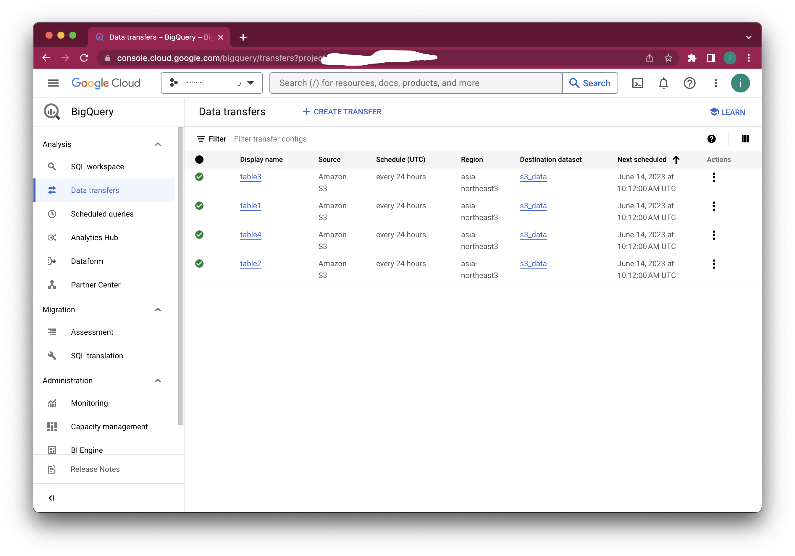
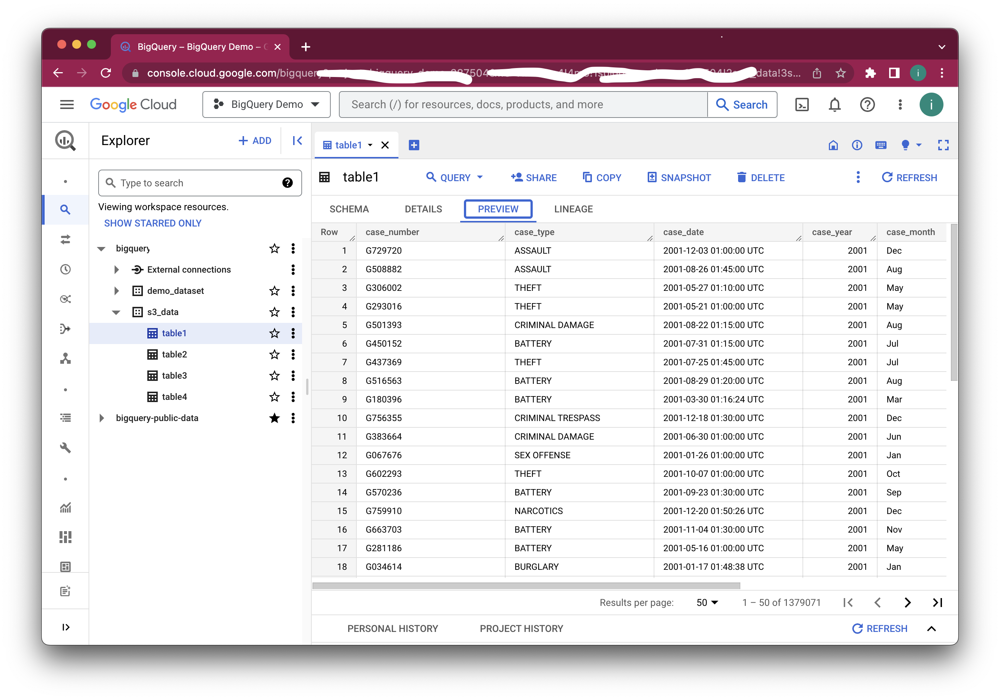

# 0. S3 테스트 bucket의 내용

Prefix(folder)가 2 depth 이고 table 이름이 두번째 prefix, 그 아래 데이터. 
이런 구조의 데이터가 수백개가 있는 경우를 가정. 
```
aws s3 ls s3://curated-bucket-98382 --recursive
2023-06-13 19:31:04          0 abc/
2023-06-13 19:31:25          0 abc/table1/
2023-06-13 19:31:25    8178020 abc/table1/part-00000-68edc39c-2b84-4c9d-a7f7-6820148e7d46-c000.snappy.parquet
2023-06-13 19:31:25    8184929 abc/table1/part-00001-68edc39c-2b84-4c9d-a7f7-6820148e7d46-c000.snappy.parquet
2023-06-13 19:31:25    8188552 abc/table1/part-00002-68edc39c-2b84-4c9d-a7f7-6820148e7d46-c000.snappy.parquet
2023-06-13 19:31:25    8184704 abc/table1/part-00003-68edc39c-2b84-4c9d-a7f7-6820148e7d46-c000.snappy.parquet
2023-06-13 19:31:25          0 abc/table2/
2023-06-13 19:31:25    8168560 abc/table2/part-00004-68edc39c-2b84-4c9d-a7f7-6820148e7d46-c000.snappy.parquet
2023-06-13 19:31:25    8186276 abc/table2/part-00005-68edc39c-2b84-4c9d-a7f7-6820148e7d46-c000.snappy.parquet
2023-06-13 19:31:25    8186842 abc/table2/part-00006-68edc39c-2b84-4c9d-a7f7-6820148e7d46-c000.snappy.parquet
2023-06-13 19:31:25    8180305 abc/table2/part-00007-68edc39c-2b84-4c9d-a7f7-6820148e7d46-c000.snappy.parquet
2023-06-13 19:31:25    8179586 abc/table2/part-00008-68edc39c-2b84-4c9d-a7f7-6820148e7d46-c000.snappy.parquet
2023-06-13 19:31:10          0 def/
2023-06-13 19:31:49          0 def/table3/
2023-06-13 19:31:49    8184260 def/table3/part-00009-68edc39c-2b84-4c9d-a7f7-6820148e7d46-c000.snappy.parquet
2023-06-13 19:31:49    8174556 def/table3/part-00010-68edc39c-2b84-4c9d-a7f7-6820148e7d46-c000.snappy.parquet
2023-06-13 19:31:49    8171939 def/table3/part-00011-68edc39c-2b84-4c9d-a7f7-6820148e7d46-c000.snappy.parquet
2023-06-13 19:31:49    8184096 def/table3/part-00012-68edc39c-2b84-4c9d-a7f7-6820148e7d46-c000.snappy.parquet
2023-06-13 19:31:49          0 def/table4/
2023-06-13 19:31:49    8186224 def/table4/part-00013-68edc39c-2b84-4c9d-a7f7-6820148e7d46-c000.snappy.parquet
2023-06-13 19:31:49    8197825 def/table4/part-00014-68edc39c-2b84-4c9d-a7f7-6820148e7d46-c000.snappy.parquet
2023-06-13 19:31:49    8192127 def/table4/part-00015-68edc39c-2b84-4c9d-a7f7-6820148e7d46-c000.snappy.parquet
2023-06-13 19:31:49    8184263 def/table4/part-00016-68edc39c-2b84-4c9d-a7f7-6820148e7d46-c000.snappy.parquet
```

# 1. S3 to BigQuery

BigQuery Transfer Service를 이용해서 S3 데이터를 BigQuery 테이블로 직접 가져오는 방법. 테이블의 수가 많으면 Console UI를 통해서 하나씩 등록하면서 작업하기에는 많기 때문에 스크립트를 통해서 자동화 할 수 있다. 

## 관련문서
[Amazon S3 전송](https://cloud.google.com/bigquery/docs/s3-transfer?hl=ko)

## 준비작업
전체 실행은 Google Cloud Shell 에서 실행 추천. 

### 1. install aws cli 
[참고문서](https://docs.aws.amazon.com/cli/latest/userguide/getting-started-install.html)

aws s3 ls s3://bucketname 명령으로 prefix를 가져오는 명령을 실행하기 위해 설치
```
curl "https://awscli.amazonaws.com/awscli-exe-linux-x86_64.zip" -o "awscliv2.zip"
unzip awscliv2.zip
sudo ./aws/install
```

### 2. gcloud login 
사용자는 bigquery/Admin IAM role 이 필요하다. 
```
gcloud auth login
```
### 3. 프로젝트 지정 및 API 사용 설정
```
gcloud projects list

gcloud config set project PROJECT_ID

gcloud services enable bigquerydatatransfer.googleapis.com
```

### 4. AWS bucket에 AmazonS3ReadOnlyAccess policy 적용
S3 읽기 위한 권한 설정 후 Access key와 Secret 

### 5. AWS user의 access key와 Secret를 생성해서 cli 로그인 
```
aws configure
```

### 6. BigQuery에 데이터셋 생성 [참고문서](https://cloud.google.com/bigquery/docs/datasets?hl=ko)
asia-northeast3 (seoul) 지역에 BigQuery Dataset 생성

### 7. 스크립트 준비 
```
git clone https://github.com/ilseokoh/s3-bq-transfer.git
chmod +x s3-bq-transfer.sh
```

### 8. s3-bq-transfer.sh 스크립트 상단에 변수 셋업

```bash
AWS_BUCKET_NAME=          # AWS Bucket name
PROJECT_ID=               # GCP Project ID
DATASET=                  # 미리 만들어 놓은 BigQuery Dataset
AWS_KEY_ID=               # Access Key ID
AWS_SECRET_ACCESS_KEY=    # Secret 
PREFIX_DEPTH_1=           # 첫번째 폴더 이름
```

## 실행 

```
./s3-bq-transfer.sh
```

샘플 실행결과 
```
❯ ./setup
declare -a table_arr='([0]="table1/" [1]="table2/" [2]="table3/" [3]="table4/" [4]="18:58:58")'
Create table1 ....
Table 'demo-387504:s3_data.table1' successfully created.
Transfer configuration 'projects/537301467034/locations/asia-northeast3/transferConfigs/6485cd8e-0000-2756-a808-3c286d35780e' successfully created.
Create table2 ....
Table 'demo-387504:s3_data.table2' successfully created.
Transfer configuration 'projects/537301467034/locations/asia-northeast3/transferConfigs/6486b0b2-0000-2d26-8770-3c286d356472' successfully created.
Create table3 ....
Table 'demo-387504:s3_data.table3' successfully created.
Transfer configuration 'projects/537301467034/locations/asia-northeast3/transferConfigs/6485c46c-0000-2760-b71a-3c286d3556fa' successfully created.
Create table4 ....
Table 'demo-387504:s3_data.table4' successfully created.
/Users/iloh/source/google-cloud-sdk/platform/bq/bq.py:18: DeprecationWarning: 'pipes' is deprecated and slated for removal in Python 3.13
  import pipes
Transfer configuration 'projects/537301467034/locations/asia-northeast3/transferConfigs/6485cf0c-0000-2f74-8284-3c286d3543e2' successfully created.
```

Transfer 가 생성되고 자동실행 됩니다. 기본값을 24시간에 한번 실행되면서 변경된 내용을 다시 전송합니다. 


BigQuery에 테이블이 생성되었습니다. 


## Trouble Shoting 

### 이런 Warning 이 발생하는데 무시. 
```
/Users/iloh/source/google-cloud-sdk/platform/bq/bq.py:18: DeprecationWarning: 'pipes' is deprecated and slated for removal in Python 3.13
  import pipes
```

### Auth를 다시하라는 메시지와 함께 멈춤 
gcloud auth login 을 했음에도 실행 중간 (특히 tranfer를 만들때) URL을 웹 브라우저에 넣고 version_info를 요구할 때 
**하라는 데로 URL에 접속해서 로그인하고 나온 결과 token을 입력**
```
https://www.gstatic.com/bigquerydatatransfer/oauthz/auth?client_id=433065040935-rurojv99l326k2c1fpit6sfpj4v5m8tf.apps.googleusercontent.com&scope=https://www.googleapis.com/auth/bigquery&redirect_uri=urn:ietf:wg:oauth:2.0:oob&response_type=version_info
Please copy and paste the above URL into your web browser and follow the instructions to retrieve a version_info.
Enter your version_info here:
```

그럼에도 다시 또 물어보면 bq cli의 버그를 우회 해보자. 
1. US 지역에 BigQuery Dataset을 만든다. 
1. s3-bq-transfer.sh의 DATASET을 수정한다. (US 로 만든 걸로)
1. s3-bq-transfer.sh 실행. 과정에서 다시 같은 메시지(Enter your version_info here:)가 나오면 하라는데로 로그인해준다. 
1. 이건 임시방편이므로 실행이 되지 않게 (비용이 나가지 않도록) 클라우드 콘솔에서 BigQuery 메뉴에서 Transfer Service를 삭제한다. 
1. 다시 s3-bq-transfer.sh 의 DATASET 을 원래 dataset으로 변경하고 다시 실행한다. 

# 2. S3 to GCP

GCP의 Storage Transfer Service를 이용해서 S3 데이터를 직접 GCS로 복제. S3의 Bucket 안에 특정 prefix가 일치하는 것만 복사. 

## 관련문서 
[Storage Transfer Service 전송 만들기](https://cloud.google.com/storage-transfer/docs/create-transfers?hl=ko)

## 준비작업 

### 1. gcloud login 
사용자는 bigquery/Admin IAM role 이 필요하다. 
```
gcloud auth login
```
### 2. 프로젝트 지정 및 API 사용 설정
```
gcloud projects list

gcloud config set project PROJECT_ID

gcloud services enable storagetransfer.googleapis.com
```

### 3. AWS bucket에 AmazonS3ReadOnlyAccess policy 적용
S3 읽기 위한 권한 설정 후 Access key와 Secret 
[creds.txt](./creds.txt) 파일에 입력한다. 
```json
{
  "accessKeyId": "",
  "secretAccessKey": ""
}
```

### 4. 스크립트 준비 
```
git clone https://github.com/ilseokoh/s3-bq-transfer.git
chmod +x s3-gcs-transfer.sh
```

### 5. s3-gcs-transfer.sh 스크립트 상단에 변수 셋업

```bash
AWS_BUCKET_NAME=    # AWS 버킷이름
GCS_BUCKET_NAME=    # GCS 버킷이름
INCLUDE_PREFIXES    # 전송 대상의 첫번째 prefix를 콤마로 불리해서 입력 ex) abc,def
```

## 실행 

```
./s3-gcs-transfer.sh
```

```
./s3-gcs-transfer.sh
creationTime: '2023-06-14T11:40:56.642705931Z'
description: S3 data trasfer include 'def'
lastModificationTime: '2023-06-14T11:40:56.642705931Z'
loggingConfig:
  enableOnpremGcsTransferLogs: true
name: transferJobs/s3_transfer_2017011544
schedule:
  scheduleEndDate:
    day: 14
    month: 6
    year: 2023
  scheduleStartDate:
    day: 14
    month: 6
    year: 2023
status: ENABLED
transferSpec:
  awsS3DataSource:
    bucketName: 
  gcsDataSink:
    bucketName: 
  objectConditions:
    includePrefixes:
    - def
Polling for latest operation name...done.                                                                           
Operation name: transferJobs-s3_transfer_2017011544-10096357153330138279
Parent job: s3_transfer_2017011544
Start time: 2023-06-14T11:40:57.811979794Z
SUCCESS | 100% (62.4MiB of 62.4MiB) | Skipped: 0B | Errors: 0 : 0 -
End time: 2023-06-14T11:41:29.867241457Z
```

# 3. BigQuery Omni 테이블 생성 

BigQuery Omni 설정이 되어 있는 상태에서 S3 데이터로 테이블을 생성하는데 수백개의 테이블이 있을 경우.

## 관련문서 
[Amazon S3 BigLake 테이블 만들기](https://cloud.google.com/bigquery/docs/omni-aws-create-external-table?hl=ko#bq)

## 사전준비 

### 1. install aws cli 
[참고문서](https://docs.aws.amazon.com/cli/latest/userguide/getting-started-install.html)

aws s3 ls s3://bucketname 명령으로 prefix를 가져오는 명령을 실행하기 위해 설치
```
curl "https://awscli.amazonaws.com/awscli-exe-linux-x86_64.zip" -o "awscliv2.zip"
unzip awscliv2.zip
sudo ./aws/install
```

### 2. gcloud login 
사용자는 bigquery/Admin IAM role 이 필요하다. 
```
gcloud auth login
```
### 3. 프로젝트 지정 및 API 사용 설정
```
gcloud projects list

gcloud config set project PROJECT_ID

gcloud services enable bigquery.googleapis.com
```

### 4. AWS user의 access key와 Secret를 생성해서 cli 로그인 
```
aws configure
```

### 5. BigQuery에 데이터셋 생성 
[참고문서](https://cloud.google.com/bigquery/docs/datasets?hl=ko)
aws-ap-northeast-2 (seoul) 지역에 BigQuery Dataset 생성

### 7. 스크립트 준비 
```
git clone https://github.com/ilseokoh/s3-bq-transfer.git
chmod +x s3-bq-omni.sh
```

### 8. s3-bq-omni.sh 스크립트 상단에 변수 셋업

```bash
BQ_DATASET=         # 생성한 BQ 데이터셋 이름
FORMAT=             # 원본 포멧: PARQUET
AWS_BUCKET_NAME=    # AWS 버킷 이름
CONNECTION_ID=      # BigQuery Omni Connection id
PREFIX_DEPTH_1=     # 첫번째 폴더 이름
```

## 실행 

```
./s3-bq-omni.sh
```

# 4. GCS에서 BigQuery로 데이터 로드 (native table)

## 참고문서 
[Cloud Storage에서 Parquet 데이터 로드](https://cloud.google.com/bigquery/docs/loading-data-cloud-storage-parquet?hl=ko)

## 사전준비 

### 1. gcloud login 
사용자는 bigquery/Admin IAM role 이 필요하다. 
```
gcloud auth login
```
### 2. 프로젝트 지정 및 API 사용 설정
```
gcloud projects list

gcloud config set project PROJECT_ID

gcloud services enable bigquery.googleapis.com
```

### 5. BigQuery에 데이터셋 생성 
[참고문서](https://cloud.google.com/bigquery/docs/datasets?hl=ko)

### 7. 스크립트 준비 
```
git clone https://github.com/ilseokoh/s3-bq-transfer.git
chmod +x gcs-bq-native.sh
```

### 8. s3-bq-omni.sh 스크립트 상단에 변수 셋업

```bash
BQ_DATASET=         # 생성한 BQ 데이터셋 이름
FORMAT=             # 원본 포멧: PARQUET
AWS_BUCKET_NAME=    # AWS 버킷 이름
CONNECTION_ID=      # BigQuery Omni Connection id
PREFIX_DEPTH_1=     # 첫번째 폴더 이름

PROJECT_ID=         # 프로젝트 ID
GCS_BUCKET_NAME=    # GCS 버킷 이름
DATASET=            # 생성한 BQ 데이터셋 이름
PREFIX_DEPTH_1=     # 첫번째 폴더 이름
```

## 실행 

```
./gcs-bq-native.sh
```